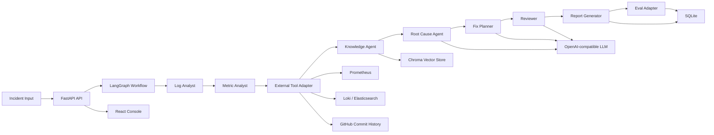

# Multi-Agent Incident Response System

一个面向 SRE / 后端 / 平台工程场景的多 Agent 故障响应系统。

系统接收一次线上故障的告警、日志、指标和时间窗口，自动组织多个专业 Agent 完成日志分析、指标分析、历史知识检索、外部工具查询、根因推断、修复计划生成、风险审核和报告输出。项目重点不是做聊天机器人，而是展示一个可运行、可测试、可观测、可扩展的 AI Agent 工程系统。

## 功能概览

当前版本已经实现：

- FastAPI 后端服务
- LangGraph 多 Agent 工作流
- React + Vite + TypeScript 前端控制台
- OpenAI-compatible LLM 接入，支持正规模型厂商和 API 中转站
- LLM mock / fallback，未配置模型时仍可完整运行
- Chroma 向量 RAG，本地知识库持久化检索
- deterministic local embedding，不依赖外部 embedding API
- Prometheus / Loki / Elasticsearch / GitHub commit history 真实 HTTP client
- 外部工具 mock fallback，未配置真实工具时自动使用 mock 数据
- SQLite 运行历史、报告和 trace 持久化
- Eval Adapter，记录 Agent 执行、工具调用、LLM token、latency、fallback 等信息
- Human approval API，支持高风险修复计划 approve / reject
- Dockerfile 和 docker-compose
- 后端 pytest 测试与前端生产构建

暂未实现：

- 用户认证和权限系统
- Slack / 飞书通知
- 云部署和 GitHub Actions CI
- 自动执行真实生产修复命令
- LLM-as-judge 评估
- LangGraph checkpoint / interrupt 持久化
- 多服务依赖图分析

## 系统架构



## Agent 设计

| Agent | 作用 | 主要输出 |
| --- | --- | --- |
| Log Analyst | 从日志中提取错误模式、关键日志行、疑似组件和时间线 | `LogAnalysis` |
| Metric Analyst | 分析错误率、延迟、连接池等指标异常 | `MetricAnalysis` |
| External Tool Adapter | 查询真实或 mock 的 Prometheus、日志平台、GitHub 提交历史 | `ExternalToolContext` |
| Knowledge Agent | 通过 Chroma RAG 检索历史 incident 和 runbook | `KnowledgeResults` |
| Root Cause Agent | 综合日志、指标、工具、知识库证据推断根因 | `RootCauseAnalysis` |
| Fix Planner | 生成诊断步骤、修复建议、回滚计划、验证步骤 | `FixPlan` |
| Reviewer | 审核证据链、风险和修复计划质量 | `ReviewResult` |
| Eval Adapter | 采集 trace、latency、fallback、token、tool result 等可观测信息 | `EvalReport` |

## 技术栈

后端：

- Python 3.11+
- FastAPI
- LangGraph
- Pydantic v2
- httpx
- ChromaDB
- SQLite
- pytest

前端：

- React 19
- TypeScript
- Vite
- lucide-react

基础设施：

- Docker
- docker-compose

## 目录结构

```text
.
├── backend/
│   ├── app/
│   │   ├── agents/          # Agent 实现
│   │   ├── api/             # FastAPI routes
│   │   ├── eval/            # Eval Adapter 和 trace
│   │   ├── graph/           # LangGraph workflow 和 state
│   │   ├── knowledge/       # Chroma RAG、embedding、keyword fallback
│   │   ├── llm/             # OpenAI-compatible LLM client
│   │   ├── prompts/         # LLM prompt templates
│   │   ├── reports/         # Markdown report renderer
│   │   ├── schemas/         # Pydantic schemas
│   │   ├── storage/         # SQLite persistence
│   │   └── tools/           # Prometheus / Loki / Elasticsearch / GitHub clients
│   ├── data/
│   │   ├── knowledge_base/  # 本地 incident / runbook 知识库
│   │   ├── sample_logs/     # 示例日志
│   │   └── sample_metrics/  # 示例指标
│   └── tests/
├── frontend/
│   └── src/
├── docker-compose.yml
└── README.md
```

## 快速开始

### 1. 安装后端依赖

```powershell
.\.venv\Scripts\python.exe -m pip install -r backend\requirements.txt
```

如果你不使用现有 `.venv`，可以自己创建虚拟环境：

```powershell
python -m venv .venv
.\.venv\Scripts\python.exe -m pip install -r backend\requirements.txt
```

### 2. 配置环境变量

在 `backend/.env` 中配置。没有真实 LLM 或真实外部工具时也可以不配置，系统会自动使用 mock / fallback。

最小配置：

```env
LLM_MODE=mock
TOOL_MODE=mock
```

OpenAI-compatible LLM：

```env
LLM_BASE_URL=https://example.com/v1
LLM_API_KEY=your_api_key
LLM_MODEL=your_model_name
LLM_TIMEOUT_SECONDS=30
LLM_PRIVACY_MODE=strict
```

外部工具：

```env
TOOL_MODE=auto
TOOL_TIMEOUT_SECONDS=8

PROMETHEUS_BASE_URL=http://localhost:9090
PROMETHEUS_BEARER_TOKEN=optional_token
PROMETHEUS_QUERY_TEMPLATE={metric_name}{service="{service_name}"}

LOG_SEARCH_PROVIDER=loki
LOKI_BASE_URL=http://localhost:3100
LOKI_BEARER_TOKEN=optional_token
LOKI_QUERY_TEMPLATE={service="{service_name}"} |= "ERROR"

ELASTICSEARCH_BASE_URL=http://localhost:9200
ELASTICSEARCH_API_KEY=optional_api_key
ELASTICSEARCH_INDEX=logs-*

GITHUB_REPOSITORY=owner/repo
GITHUB_TOKEN=optional_token
GITHUB_BRANCH=main
GITHUB_LOOKBACK_COMMITS=10
```

说明：

- `TOOL_MODE=auto`：优先请求真实工具，失败时 fallback 到 mock
- `TOOL_MODE=mock`：只使用 mock，适合本地 demo 和测试
- `LLM_PRIVACY_MODE=strict`：默认不向外部 LLM 发送 raw logs 和完整知识库正文

### 3. 启动后端

```powershell
cd backend
..\.venv\Scripts\python.exe run_server.py
```

后端地址：

```text
http://127.0.0.1:8000
```

### 4. 启动前端

```powershell
cd frontend
npm install
npm run dev
```

前端默认地址：

```text
http://127.0.0.1:5173
```

### 5. 使用 Docker Compose

```powershell
docker-compose up --build
```

服务端口：

- Backend: `http://127.0.0.1:8000`
- Frontend: `http://127.0.0.1:5173`

## API

### Health

```http
GET /health
```

### LLM 状态

```http
GET /llm/status
```

返回是否配置 base URL、API key、模型名和隐私模式。不会返回 API key 明文。

### 外部工具状态

```http
GET /tools/status
```

返回 Prometheus、Loki、Elasticsearch、GitHub 是否已配置。不会返回 token 明文。

### 运行 Incident 分析

```http
POST /incidents/run
Content-Type: application/json
```

示例请求：

```json
{
  "service_name": "checkout-api",
  "alert_description": "Service checkout-api error rate increased from 0.5% to 12% after deployment.",
  "raw_logs": "2026-06-18T10:21:03Z ERROR checkout-api DatabaseConnectionTimeout while acquiring database connection",
  "metrics": {
    "error_rate": {
      "before": 0.005,
      "after": 0.12
    },
    "p95_latency_ms": {
      "before": 230,
      "after": 2400
    },
    "db_connection_pool_usage": {
      "before": 0.45,
      "after": 0.98
    }
  },
  "time_window": "2026-06-18T10:20:00Z/2026-06-18T10:30:00Z"
}
```

核心响应内容：

- `report`：结构化 Incident Report
- `markdown_report`：Markdown 版本报告
- `eval_report`：Agent 执行评估
- `trace_events`：完整 workflow trace
- `tool_context`：外部工具查询结果和来源
- `metadata`：LLM、工具、fallback 等执行元数据

### 历史记录

```http
GET /incidents
GET /incidents/{incident_id}
GET /incidents/{incident_id}/trace
```

### 人工审批

```http
POST /incidents/{incident_id}/approve
POST /incidents/{incident_id}/reject
```

请求示例：

```json
{
  "approved_by": "local-user",
  "note": "Approved for demo."
}
```

## RAG 设计

知识库目录：

```text
backend/data/knowledge_base/
```

当前支持：

- JSON incident cases
- Markdown runbook
- Chroma vector search
- deterministic local embedding
- keyword fallback
- retrieval mode 记录

Chroma 数据默认写入：

```text
backend/data/chroma/
```

该目录已被 `.gitignore` 排除。

## 外部工具设计

外部工具采用统一策略：

```text
real HTTP client -> mock fallback
```

也就是说：

- 配置真实工具时，系统优先请求真实 API
- 请求失败时，记录 `tool_errors`，然后回退 mock
- 没有配置真实工具时，直接使用 mock，不视为错误

当前工具：

| 工具 | 用途 | 配置 |
| --- | --- | --- |
| Prometheus | 查询服务指标，如错误率、延迟、连接池使用率 | `PROMETHEUS_BASE_URL` |
| Loki | 查询日志流 | `LOKI_BASE_URL` |
| Elasticsearch | 查询结构化日志 | `ELASTICSEARCH_BASE_URL` |
| GitHub | 查询最近 commit history | `GITHUB_REPOSITORY` |

前端 Tools tab 会显示每类工具结果的来源：

- `real`
- `mock`
- `mock_fallback`

## LLM 设计

Root Cause Agent、Fix Planner Agent、Reviewer Agent 会优先调用真实 LLM。

当以下情况发生时，系统会自动 fallback 到规则逻辑：

- 未配置 LLM
- LLM 请求失败
- LLM 超时
- LLM 返回 JSON 不符合 Pydantic schema

LLM metadata 会进入 trace / eval：

- provider
- model
- prompt version
- privacy mode
- prompt tokens
- completion tokens
- total tokens
- latency
- error type
- fallback reason

## 前端控制台

前端包含：

- Incident 输入面板
- Run History
- Incident Report
- Tools tab
- Trace tab
- Eval tab
- LLM status tab
- Human approval 操作

## 测试

运行后端测试：

```powershell
cd backend
..\.venv\Scripts\python.exe -m pytest -q
```

运行前端构建：

```powershell
cd frontend
npm run build
```

当前测试覆盖：

- API smoke test
- workflow 端到端测试
- LLM agent JSON schema 测试
- Chroma RAG 测试
- external tools HTTP client 解析测试
- history / trace / approval API 测试

## 数据与安全

默认不会提交以下本地数据：

- `backend/.env`
- `backend/data/incidents.db`
- `backend/data/chroma/`
- `frontend/node_modules/`
- `frontend/dist/`

当前安全边界：

- `.env` 不入库
- API key / token 不通过 status API 明文返回
- strict privacy mode 下不向外部 LLM 发送 raw logs 和完整知识库正文
- 高风险修复计划需要人工审批
- 系统只生成修复建议，不自动执行生产修复命令

## 当前边界

这是一个面向学习、展示和迭代的工程型 MVP，不是生产可直接上线的事故处置平台。

当前未做：

- 认证和权限
- 多租户隔离
- 生产级日志脱敏
- prompt injection 防护
- 工具调用 allowlist / policy engine
- CI/CD
- 云部署
- 通知系统
- 自动创建 Jira / GitHub issue
- 自动执行修复命令

## 后续方向

如果继续迭代，优先级建议如下：

1. 增加 `.env.example`，降低新环境启动成本
2. 增加 GitHub Actions，自动跑 pytest 和 frontend build
3. 增加更完整的日志脱敏和 prompt injection 防护
4. 增加 Slack / 飞书通知
5. 增加 LLM-as-judge 或离线评估集
6. 增加多服务依赖图和影响范围分析
7. 增加 postmortem 自动生成

## License

未指定。可以根据项目用途后续补充 MIT、Apache-2.0 或其他许可证。
