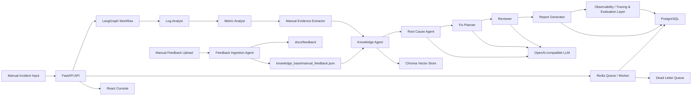

# Multi-Agent Incident Response System

一个面向 SRE / 后端 / 平台工程场景的多 Agent 故障响应系统。

当前项目聚焦于**手动上传故障材料后的本地智能分析**：用户提供告警、日志、指标、系统反馈或排障记录，系统通过多 Agent workflow 完成证据提取、历史知识检索、根因推断、修复建议、风险审核和报告生成。

项目不会主动连接或扫描真实生产系统，也不会自动进入 Prometheus、Loki、Elasticsearch、GitHub 等外部平台排查。所有分析输入都来自用户手动提供的材料。

## 功能概览

当前版本已经实现：

- FastAPI 后端服务
- LangGraph 多 Agent 工作流
- React + Vite + TypeScript 前端控制台
- OpenAI-compatible LLM 接入，支持正规模型厂商和 API 中转站
- LLM mock / fallback，未配置模型时仍可完整运行
- Chroma 向量 RAG，本地知识库持久化检索
- deterministic local embedding，不依赖外部 embedding API
- 手动日志、指标、告警内容的本地证据提取
- Manual Feedback Ingestion Agent：识别手动上传的系统反馈类型，脱敏、结构化并写入文档
- PostgreSQL 运行历史、报告、trace 与 workflow job 持久化
- observability / tracing & evaluation layer，保留 trace、评估、LLM token、latency、fallback 等能力，并新增 Prometheus 指标导出
- Human approval API，支持高风险修复计划 approve / reject
- SaaS / governance layer：多租户 API key、租户级 request / workflow quota、audit events、production config approval 与 release gate
- Dockerfile 和 docker-compose
- 后端 pytest 测试与前端生产构建

## 系统架构



## Agent 设计

| Agent | 作用 | 主要输出 |
| --- | --- | --- |
| Log Analyst | 从手动输入日志中提取错误模式、关键日志、疑似组件和时间线 | `LogAnalysis` |
| Metric Analyst | 从手动输入指标中分析错误率、延迟、连接池等异常 | `MetricAnalysis` |
| Manual Evidence Extractor | 从手动输入的 logs / metrics / alert 中提取本地证据 | `ExternalToolContext` |
| Knowledge Agent | 通过 Chroma RAG 检索历史 incident、runbook、manual feedback | `KnowledgeResults` |
| Root Cause Agent | 综合日志、指标、本地证据、知识库结果推断根因 | `RootCauseAnalysis` |
| Fix Planner | 生成诊断步骤、修复建议、回滚计划、验证步骤 | `FixPlan` |
| Reviewer | 审核证据链、风险和修复计划质量 | `ReviewResult` |
| Feedback Ingestion Agent | 对手动上传的系统反馈进行分类、脱敏、结构化和文档沉淀 | `StructuredFeedbackDocument` |
| Observability / Tracing & Evaluation Layer | 保留 trace、latency、fallback、token、retrieval result 等可观测能力，并输出 Prometheus metrics | `EvalReport` |

## 技术栈

后端：

- Python 3.11+
- FastAPI
- LangGraph
- Pydantic v2
- httpx
- ChromaDB
- PostgreSQL
- Redis
- SQLAlchemy Async
- Multi-tenant API keys / quotas / audit events
- pytest

前端：

- React 19
- TypeScript
- Vite
- lucide-react

基础设施：

- Docker
- docker-compose

## 目录结构

```text
.
├── backend/
│   ├── app/
│   │   ├── agents/          # Agent 实现
│   │   ├── api/             # FastAPI routes
│   │   ├── eval/            # tracing & evaluation 逻辑
│   │   ├── graph/           # LangGraph workflow 和 state
│   │   ├── knowledge/       # Chroma RAG、embedding、keyword fallback
│   │   ├── llm/             # OpenAI-compatible LLM client
│   │   ├── observability.py # Prometheus metrics 与 observability helpers
│   │   ├── prompts/         # LLM prompt templates
│   │   ├── reports/         # Markdown report renderer
│   │   ├── schemas/         # Pydantic schemas
│   │   ├── storage/         # PostgreSQL / async persistence
│   │   └── tools/           # 本地证据提取工具
│   ├── data/
│   │   ├── knowledge_base/  # 本地 incident / runbook / manual feedback 知识库
│   │   ├── sample_logs/     # 示例日志
│   │   └── sample_metrics/  # 示例指标
│   └── tests/
├── docs/
│   └── feedback/            # 手动反馈入库后生成的脱敏 Markdown
├── frontend/
│   └── src/
├── monitoring/
│   ├── prometheus/
│   └── grafana/
├── docker-compose.yml
└── README.md
```

## 快速开始

### 1. 安装后端依赖

```powershell
.\.venv\Scripts\python.exe -m pip install -r backend\requirements.txt
```

如果你不使用现有 `.venv`，可以自己创建虚拟环境：

```powershell
python -m venv .venv
.\.venv\Scripts\python.exe -m pip install -r backend\requirements.txt
```

### 2. 配置环境变量

在 `backend/.env` 中配置。没有真实 LLM 时也可以不配置，系统会使用 mock / fallback。

最小配置：

```env
LLM_MODE=mock
```

OpenAI-compatible LLM：

```env
LLM_BASE_URL=https://example.com/v1
LLM_API_KEY=your_api_key
LLM_MODEL=your_model_name
LLM_TIMEOUT_SECONDS=30
LLM_PRIVACY_MODE=strict
```

说明：

- `LLM_MODE=mock`：只使用规则和 mock，适合本地 demo
- 配置 `LLM_BASE_URL`、`LLM_API_KEY`、`LLM_MODEL` 后，系统会优先调用真实 LLM
- `LLM_PRIVACY_MODE=strict`：默认不向外部 LLM 发送 raw logs 和完整知识库正文
- 后端现在只支持 PostgreSQL；本地启动前请先准备可访问的 `APP_DATABASE_URL`
- `APP_REDIS_URL` 不是同步 `/incidents/run` 的必需项，但异步 job / worker / retry / DLQ 依赖 Redis

### 3. 启动后端

```powershell
cd backend
..\.venv\Scripts\python.exe run_server.py
```

后端地址：

```text
http://127.0.0.1:8000
```

### 4. 启动前端

```powershell
cd frontend
npm install
npm run dev
```

前端默认地址：

```text
http://127.0.0.1:5173
```

### 5. 使用 Docker Compose

```powershell
docker-compose up --build
```

服务端口：

- Backend: `http://127.0.0.1:8000`
- Frontend: `http://127.0.0.1:5173`
- PostgreSQL: `127.0.0.1:5432`
- Redis: `127.0.0.1:6379`
- Prometheus: `http://127.0.0.1:9090`
- Grafana: `http://127.0.0.1:3000`

Grafana 默认账号：

- Username: `admin`
- Password: `admin`

## API

### Health

```http
GET /health
```

### LLM 状态

```http
GET /llm/status
```

返回是否配置 base URL、API key、模型名和隐私模式。不会返回 API key 明文。

### Prometheus Metrics

```http
GET /metrics
```

该端点由 observability / tracing & evaluation layer 导出，当前覆盖：

- HTTP 请求总数与时延
- workflow run 总数与时延
- workflow job 入队、执行、重试与 dead letter 事件
- agent / node 执行总数与时延
- feedback ingest 总数与时延
- LLM 调用次数、token 使用量与延迟

### 运行 Incident 分析

```http
POST /incidents/run
Content-Type: application/json
```

示例请求：

```json
{
  "service_name": "checkout-api",
  "alert_description": "Service checkout-api error rate increased from 0.5% to 12% after deployment.",
  "raw_logs": "2026-06-18T10:21:03Z ERROR checkout-api DatabaseConnectionTimeout while acquiring database connection",
  "metrics": {
    "error_rate": {
      "before": 0.005,
      "after": 0.12
    },
    "p95_latency_ms": {
      "before": 230,
      "after": 2400
    },
    "db_connection_pool_usage": {
      "before": 0.45,
      "after": 0.98
    }
  },
  "time_window": "2026-06-18T10:20:00Z/2026-06-18T10:30:00Z"
}
```

核心响应内容：

- `report`：结构化 Incident Report
- `markdown_report`：Markdown 版本报告
- `eval_report`：Agent 执行评估
- `trace_events`：完整 workflow trace
- `evidence_context`：从手动输入中提取出的本地证据
- `metadata`：LLM、fallback、retrieval 等执行元数据

### 手动反馈入库

```http
POST /feedback/ingest
Content-Type: application/json
```

示例请求：

```json
{
  "source_name": "ops-console",
  "raw_content": "ERROR checkout-api DatabaseConnectionTimeout token=secret123 from 10.1.2.3",
  "note": "Captured after manual investigation."
}
```

该接口会：

- 自动识别反馈类型
- 基础脱敏
- 提取关键信号
- 写入 `docs/feedback/*.md`
- 同步到 `backend/data/knowledge_base/manual_feedback.json`
- 刷新 Chroma RAG 索引

### 历史记录

```http
GET /incidents
GET /incidents/{incident_id}
GET /incidents/{incident_id}/trace
```

### Workflow Job Queue

```http
POST /incidents/submit
GET /jobs/{job_id}
```

`/incidents/submit` 会把 incident workflow 提交到 Redis 队列，由独立 worker 异步执行。
`/jobs/{job_id}` 可查看 `queued`、`running`、`retry_scheduled`、`completed`、`failed`、`dead_letter` 状态，以及重试次数、下次重试时间、trace / run 关联信息。

### SaaS / Governance

```http
POST /admin/tenants
POST /admin/tenants/{tenant_id}/keys
GET /tenant/quota
GET /tenant/audit-events
POST /admin/config-approvals
POST /admin/config-approvals/{approval_id}/approve
```

- `APP_ADMIN_API_TOKEN` 用于平台级 SaaS / 治理接口
- tenant API key 支持 scope、quota 与审计
- `APP_OPERATIONS_MODE=production` 时，`/incidents/run` 和 `/incidents/submit` 需要 `X-Release-Approval`

### 人工审批

```http
POST /incidents/{incident_id}/approve
POST /incidents/{incident_id}/reject
```

请求示例：

```json
{
  "approved_by": "local-user",
  "note": "Approved for demo."
}
```

## 手动反馈入库设计

`docs/` 目录主要用于人类阅读的项目文档和脱敏排障记录。为了让 Agent 也能利用这些经验，系统新增了 Manual Feedback Ingestion Agent。

推荐流程：

```text
手动复制系统反馈 / 报错 / 排障记录
        ↓
前端 Manual Feedback 区域粘贴并保存
        ↓
Feedback Ingestion Agent 分类、脱敏、结构化
        ↓
生成 docs/feedback/*.md
        ↓
写入 backend/data/knowledge_base/manual_feedback.json
        ↓
Knowledge Agent 通过 Chroma RAG 检索
```

当前支持识别的类型：

- `error_log`
- `metric_snapshot`
- `incident_report`
- `runbook`
- `deployment_note`
- `unknown`

注意：自动脱敏是基础规则，提交真实材料前仍建议人工复查。

## RAG 设计

知识库目录：

```text
backend/data/knowledge_base/
```

当前支持：

- JSON incident cases
- Markdown runbook
- Manual feedback records
- Chroma vector search
- deterministic local embedding
- keyword fallback
- retrieval mode 记录

Chroma 数据默认写入：

```text
backend/data/chroma/
```

该目录已被 `.gitignore` 排除。

## LLM 设计

Root Cause Agent、Fix Planner Agent、Reviewer Agent 会优先调用真实 LLM。

当以下情况发生时，系统会自动 fallback 到规则逻辑：

- 未配置 LLM
- LLM 请求失败
- LLM 超时
- LLM 返回 JSON 不符合 Pydantic schema

LLM metadata 会进入 observability / tracing & evaluation layer：

- provider
- model
- prompt version
- privacy mode
- prompt tokens
- completion tokens
- total tokens
- latency
- error type
- fallback reason

## 前端控制台

前端包含：

- Incident 输入面板
- Manual Feedback 保存入口
- Run History
- Incident Report
- Evidence tab
- Trace tab
- Eval tab
- LLM status tab
- Human approval 操作

## 测试

运行后端测试：

```powershell
cd backend
..\.venv\Scripts\python.exe -m pytest -q
```

说明：
- workflow 测试可在无数据库的情况下运行
- API 集成测试需要可访问的 PostgreSQL；若本机未启动 PostgreSQL，会自动跳过

运行前端构建：

```powershell
cd frontend
npm run build
```

当前测试覆盖：

- API smoke test
- `/metrics` 可访问性测试
- workflow 端到端测试
- LLM agent JSON schema 测试
- Chroma RAG 测试
- manual feedback ingestion 测试
- history / trace / approval API 测试

## 数据与安全

默认不会提交以下本地数据：

- `backend/.env`
- `backend/data/chroma/`
- `frontend/node_modules/`
- `frontend/dist/`

当前安全边界：

- `.env` 不入库
- API key 不通过 status API 明文返回
- strict privacy mode 下不向外部 LLM 发送 raw logs 和完整知识库正文
- 手动反馈入库会进行基础脱敏
- 高风险修复计划需要人工审批
- 系统只生成修复建议，不自动执行生产修复命令
- 系统不会主动连接真实生产系统排查

## 当前边界

这是一个面向学习、展示和迭代的工程型 MVP，不是生产可直接上线的事故处置平台。

当前未做：

- 自动进入真实系统排查
- 认证和权限
- 多租户隔离
- 生产级日志脱敏
- prompt injection 防护
- 工具调用 allowlist / policy engine
- CI/CD
- 云部署
- 通知系统
- 自动创建 Jira / GitHub issue
- 自动执行修复命令

## 后续方向

如果继续迭代，优先级建议如下：

1. 增加 `.env.example`，降低新环境启动成本
2. 增加 GitHub Actions，自动跑 pytest 和 frontend build
3. 增加更完整的日志脱敏和 prompt injection 防护
4. 增加 Slack / 飞书通知
5. 增加 LLM-as-judge 或离线评估集
6. 增加多服务依赖图和影响范围分析
7. 增加 postmortem 自动生成

## License

未指定。可以根据项目用途后续补充 MIT、Apache-2.0 或其他许可证。
